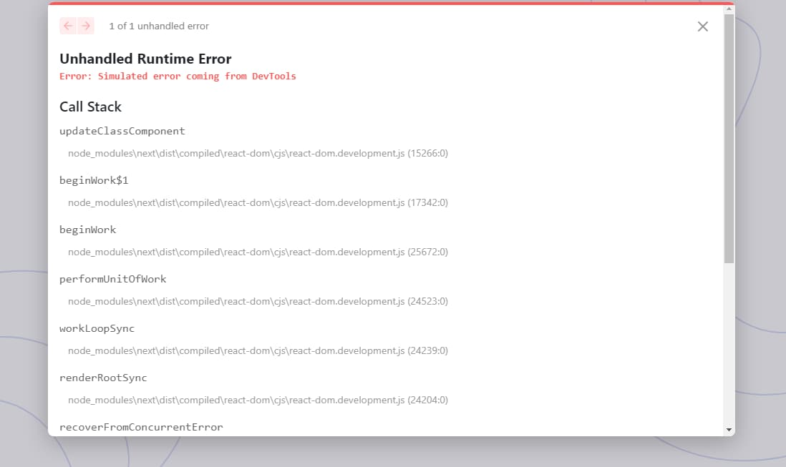

<picture>
  <source media="(prefers-color-scheme: dark)" srcset="./design/dark-banner.jpg">
  <source media="(prefers-color-scheme: light)" srcset="./design/light-banner.jpg">
  
</picture>

# Pricing Component with Toggle

> Also, I want to practice using React. I think it would be better if I had done the challenge with the technologies that I usually use first. Then, I will be able to focus on the React instead of thinking about everything from scratch.

I said that on another README's GitHub repository and finally, here is a project with React.

I completed this challenge four months ago without a JavaScript framework — [GitHub - vanzasetia/pricing-component-with-toggle: A fun challenge from Frontend Mentor to create an accessible toggle component.](https://github.com/vanzasetia/pricing-component-with-toggle)

## The challenge

My challenge is to build out this pricing component and get it looking as close to the design as possible.

My users should be able to:

- View the optimal layout for the component depending on their device's screen size
- Control the toggle with both their mouse/trackpad and their keyboard

## Explore this project

- [Live review](https://reactpricingcomponent.netlify.app/)
- [Frontend Mentor solution page]()

## Built with

- [Next.js](https://nextjs.org/)
- [BEM (Block, Element, Modifier)](https://sparkbox.com/foundry/bem_by_example)
- CSS Flexbox
- Mobile-first workflow
- [scriptex/hover-media-query](https://github.com/scriptex/hover-media-query) - a progressively enhanced "hover" media query.

## What I learned

I learned Next.js and React.

### Next.js is faster than `create-react-app`

Around a month ago, I tried using `create-react-app`, the installation time to install all the dependencies takes about 30 minutes. Then, the first time I run the dev server, the setup takes about 10 minutes. As a result, 40 minutes were spent and I still did not type a single line of code. 

I gave up on learning React.

Then, after I got my motivation back to learn React, I found that the React documentation recommends using Next.js to get started. So I decided to learn **React and Next.js**.

`npx create-next-app@latest` is much faster than `create-react-app`. The installation time is not that much different. But, the dev server gets set up in about two minutes.

`create-react-app` gave me a bad experience with React and Next.js made the experience with React a little bit better. Just a little bit.

### Next.js or NextJS

I got confused about how to write Next.js.

**Example:** I am learning **_Next.js._**

An awkward situation where a sentence has a double dot wrapping the "js".

I decided to go with Next.js instead of NextJS because that is how Vercel write it.

### Errors

I could not get proper sleep for the last two days. I always got up at 2 AM or around that time. Also, I slept at 12 AM. My sleep is in a bad state.

Anyway, I decided to copy-paste the HTML and CSS from my old solution for this challenge.

I got errors so I had to:

- change `class` to `className`,
- change `for` to `htmlFor`, and
- change `checked` to `defaultChecked`

Those are the errors that I can remember.

I learned that some HTML attributes are not compatible with React.

### React

I learned about `useState`.

I got an error where Next.js said that `useState` is not defined. I could fix it by importing the `useState` from `react`.

```javascript
import { useState } from 'react';
```

> `useState` returns an array with exactly two items

— [useState – React #useState](https://react.dev/reference/react/useState#usestate)

I learned that as well.

### Strange phenomenon

What is going on?



The error disappeared after I disabled the [React Developer Tools](https://chrome.google.com/webstore/detail/react-developer-tools/fmkadmapgofadopljbjfkapdkoienihi).

Also, sometimes the toggle works and sometimes it does not work. I am not sure whether it actually works or not.

You can help me with this. I need help. Please. I want to sleep.

## Useful resources

I used the documentation to help me build the project.

- [Docs | Next.js](https://nextjs.org/docs)
- [React](https://react.dev/)

## License

[MIT](./LICENSE)
